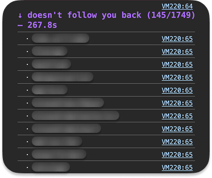

<div align="center">

</div>

#  &nbsp; ig unfollows

ever wonder who unfollowed you? instagram conveniently doesn't tell you when someone hits the unfollow button. so i wrote a tiny script that runs in your browser and tells you exactly which accounts you follow that don't follow you back. no apps to install, no third-party logins, no shady "track your unfollowers" services that mine your data.

<div align="center">

</div>

##  &nbsp; tutorial

###  &nbsp; open instagram on your computer

go to [instagram.com](https://instagram.com) and make sure you're signed in. the script works by asking instagram's own internal api for your follower data, and that api only responds to logged-in sessions.

###  &nbsp; inspect element

every browser has one built in. it's where javascript runs in the page.

```bash
chrome / arc / edge   ⌘ + option + j     (windows: ctrl + shift + j)
safari                ⌘ + option + c     (enable dev menu in settings → advanced first)
firefox               ⌘ + option + k     (windows: ctrl + shift + k)
```

once it opens, **click the `console` tab** at the top of the panel — that's where the blinking cursor lives, and where the script goes. (if you opened with the shortcuts above, you might already be there.)

> ⚠️ **chrome / arc / edge users:** the first time you try to paste into the console, you'll probably see a big scary warning that says **"don't paste!"** or **"stop!"** and refuses to let you paste. don't panic — this is just chrome being cautious because pasting random code into the console *can* be dangerous. my code is safe, you can read every line of it in [`ig-unfollows.js`](./ig-unfollows.js), and there's nothing to worry about. to unlock pasting, click into the console and **type the words `allow pasting`** (literally type it out, don't paste it), hit enter, and then you'll be able to paste normally.

###  &nbsp; paste, edit, run, wait

1. copy the contents of [`ig-unfollows.js`](./ig-unfollows.js) from this repo
2. paste it into the console
3. change the username at the bottom of the script
   - swap `placeholder` for your own handle (keep the quotes around your username, ie `yourUsername = "cocohdzz"`!)
4. hit `enter`

heads up: you'll probably see red warning text scroll by while it runs. that's instagram's api complaining about the volume of requests, not the script breaking. just let it cook. depending on how many people you follow, it can take anywhere from a few seconds to a couple minutes. so, come back to it in a bit. when it's done, the console prints a list of usernames: the people you follow who don't follow you back.

*that's it! you're done!!!!!!!!!!*

##  &nbsp; credit

inspired by [`@abir-taheer`](https://github.com/abir-taheer)'s gist on github. you can find his original code [here](https://gist.github.com/abir-taheer/0d3f1313def5eec6b78399c0fb69e4b1).

##  &nbsp; episode
- tiktok: *coming soon*
- instagram: *coming soon*

##  &nbsp; kudos

feel free to copy, fork, and share. if you make a video with it, tag me! and if you remix the code in your own project, a quick credit in the file is appreciated.
-  &nbsp; [`@cocopuffffffffs`](https://tiktok.com/@cocopuffffffffs)
-  &nbsp; [`@cocohdzz`](https://instagram.com/cocohdzz)