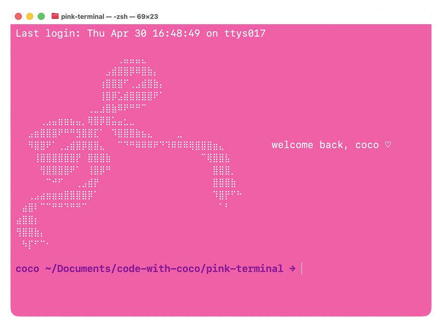

<div align="center">

</div>

#  &nbsp; pink terminal

you always see hackers in movies type in terminals with black backgrounds and neon green text. personally, it's not my vibe. so, i made mine pink! i also changed my command prompt and added a cute ascii welcome message that greets me every time i open a new window! 

<div align="center">

</div>

##  &nbsp; tutorial

###  &nbsp; colors

your background and text colors are set in the terminal settings itself, not in code.
1. open terminal
2. press `⌘` + `,`
3. click **profiles**
4. **text** tab → click the swatch next to **background** → pick your color. i used `#FF53A9` for the hot pink
5. click the swatch next to **text** and set it to white this controls the color of command output
    - the output is the stuff the terminal prints back at you, like error messages
6. uncheck **dynamic foreground colors** if checked
    - when it's on terminal auto-dims old output and brightens your active prompt so it can look like your text is randomly switching between gray and white

side note: the solid block cursor was also confusing to me (could never tell if i was going to type before or after the character selected), so i also set the cursor to **vertical bar** with **blink cursor** checked.

###  &nbsp; open your `.zshrc` file 

the rest is in code. `zshrc` stands for "z shell run commands"; it's a list of stuff your terminal runs every time it opens. the dot at the start makes it hidden by default. open your `.zshrc` file in terminal whichever editor you prefer:

```bash
nano ~/.zshrc    # beginner-friendly, shortcuts shown at the bottom
vim ~/.zshrc     # powerful but modal 
code ~/.zshrc    # opens in VS Code if installed, can move cursor around easily
```

###  &nbsp; time to customize

add these sections to your `.zshrc`. paste them in, save (`ctrl`+`o` → enter → `ctrl`+`x` in nano). i broke them down here so it's easier to follow, but i also uploaded my file in this repo. you can just copy paste from there.

####  &nbsp; command prompt

this is the line you see before every command. i chose mine to say `coco ~/Documents →` in magenta, but you can customize it however you want. i wanted it clean & simple.

```bash
PROMPT='%B%F{magenta}coco %~ →%f%b '
```

zsh supports 8 named colors out of the box (`black`, `red`, `green`, `yellow`, `blue`, `magenta`, `cyan`, `white`) plus 256 numbered colors. to see them all with their numbers, run this in your terminal:

```bash
for i in {0..255}; do print -P "%F{$i}$i %f"; done
```

then just swap `magenta` for the number you like, e.g. `%F{205}` for hot pink. for full hex code support (like matching an exact pink), you'd need a prompt framework like [starship](https://starship.rs) or [oh my zsh](https://ohmyz.sh).

####  &nbsp; welcome message

this prints every time you open a new terminal window. i found mine on [emojicombos.com](https://emojicombos.com/cute). they have tons of cute ascii art!

```bash
echo "
⠀⠀⠀⠀⠀⠀⠀⠀⠀⠀⠀⠀⠀⠀⠀⠀⠀⢀⣤⣤⣤⣄⠀⠀⠀⠀⠀⠀⠀⠀⠀⠀⠀⠀⠀⠀⠀⠀
⠀⠀⠀⠀⠀⠀⠀⠀⠀⠀⠀⠀⠀⠀⠀⣠⣾⣿⣿⡿⠿⣿⣷⡄⠀⠀⠀⠀⠀⠀⠀⠀⠀⠀⠀⠀⠀⠀
⠀⠀⠀⠀⠀⠀⠀⠀⠀⠀⠀⠀⠀⠀⢰⣿⣿⣿⠋⢀⣠⣾⣿⣷⡄⠀⠀⠀⠀⠀⠀⠀⠀⠀⠀⠀⠀⠀
⠀⠀⠀⠀⠀⠀⠀⠀⠀⠀⠀⠀⠀⠀⢸⣿⡿⣡⣾⣿⣿⣿⣿⠟⠁⠀⠀⠀⠀⠀⠀⠀⠀⠀⠀⠀⠀⠀
⠀⠀⠀⠀⠀⠀⠀⠀⠀⠀⠀⠀⢀⣀⣰⣿⣷⠿⠟⠛⠛⠉⠀⠀⠀⠀⠀⠀⠀⠀⠀⠀⠀⠀⠀⠀⠀⠀
⠀⠀⠀⠀⢀⣠⣤⣶⣶⣦⣤⡀⢿⣿⡿⣿⣥⣤⣂⣀⠀⠀⠀⠀⠀⠀⠀⠀⠀⠀⠀⠀⠀⠀⠀⠀⠀⠀
⠀⠀⣠⣶⣿⣿⣿⠟⠛⠛⣻⣿⣿⣏⠁⠀⠹⣿⣿⣿⣷⣦⣄⠀⠀⠀⠀⣀⠀⠀⠀⠀⠀⠀⠀⠀⠀⠀
⠀⠀⠻⣿⣿⠟⠁⢀⣠⣾⣿⡿⣿⣿⣄⠀⠀⠉⠙⠛⠿⠿⠿⠟⠙⠹⠿⠿⠿⢿⣿⣿⣿⣶⣄⠀⠀⠀          welcome back, coco ♡
⠀⠀⠀⢸⣿⣿⣿⣿⣿⣿⡟⠀⣿⣿⣿⣷⠀⠀⠀⠀⠀⠀⠀⠀⠀⠀⠀⠀⠀⠀⠀⠉⢿⣿⣿⣧⠀⠀
⠀⠀⠀⠀⢻⣿⣿⣿⣿⠟⠁⠀⢸⣿⡿⠛⠀⠀⠀⠀⠀⠀⠀⠀⠀⠀⠀⠀⠀⠀⠀⠀⠀⣿⣿⣿⡀⠀
⠀⠀⠀⠀⠀⠉⠚⠋⠀⠀⢀⣠⣾⡟⠀⠀⠀⠀⠀⠀⠀⠀⠀⠀⠀⠀⠀⠀⠀⠀⠀⠀⠀⣿⣿⣿⣷⠀
⠀⠀⢀⣠⣴⣶⣶⣶⣿⣿⣿⣿⡿⠁⠀⠀⠀⠀⠀⠀⠀⠀⠀⠀⠀⠀⠀⠀⠀⠀⠀⠀⠀⠹⣿⡟⠋⠓
⠀⣴⣿⠇⠉⠉⠛⠛⠙⠛⠛⠉⠀⠀⠀⠀⠀⠀⠀⠀⠀⠀⠀⠀⠀⠀⠀⠀⠀⠀⠀⠀⠀⠀⠁⠃⠀⠀
⣴⣿⣿⡆⠀⠀⠀⠀⠀⠀⠀⠀⠀⠀⠀⠀⠀⠀⠀⠀⠀⠀⠀⠀⠀⠀⠀⠀⠀⠀⠀⠀⠀⠀⠀⠀⠀⠀
⢻⣿⣿⣷⡄⠀⠀⠀⠀⠀⠀⠀⠀⠀⠀⠀⠀     
⠀⠳⡏⠋⠉⠂⠀⠀⠀⠀⠀⠀⠀⠀⠀⠀⠀⠀⠀⠀⠀⠀⠀⠀⠀⠀⠀⠀⠀⠀⠀⠀⠀⠀⠀⠀⠀⠀
"
```

####  &nbsp; aliases

aliases are shortcuts for commands you use a lot. here are some ones that i actually find useful as i'm trying to be better about committing my progress.

```bash
alias gs="git status"
alias ga="git add ."
alias gc="git commit -m"
alias gp="git push"
alias c="clear"
```

then press `⌘` + `t` to open a new tab in your terminal and see your changes reflected or run the command below.

```bash
source ~/.zshrc
```

*that's it! you're done!!!!!!!!!!*

##  &nbsp; episode
- tiktok: *coming soon*
- instagram: *coming soon*

##  &nbsp; kudos

feel free to copy, fork, and share. if you make a video with it, tag me! and if you remix the code in your own project, a quick credit in the file is appreciated.
-  &nbsp; [`@cocopuffffffffs`](https://tiktok.com/@cocopuffffffffs)
-  &nbsp; [`@cocohdzz`](https://instagram.com/cocohdzz)